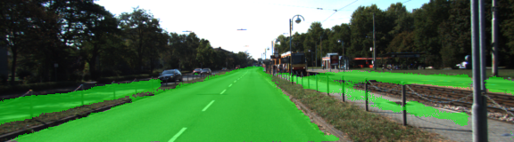

# Semantic Segmentation
Extremely fun project! We got to train a FCN using a pretrained VGG16 with fine tuning.

## Model
The FCN model is laid out as defined in: https://people.eecs.berkeley.edu/~jonlong/long_shelhamer_fcn.pdf

I used a tf.truncated_normal_initializer() for initializing the kernels of all the conv layers. This helped the predictions be WAY less noisy than otherwise. 

Trained for 50 epochs with a batch size of 16 and a tiny LR of 0.0001. The epoch was chosen primarily so that our gen_batches function has enough room to deliver 384 * 2 (augmentation) = 768 images

## Augmentation
I extended the gen_batches function to generate flipped data to augment our existing dataset. This primarily helped get around shadows being a dead zone problem!

## Caveats / Improvements
- The paper talks about using a bilinear interpolation kernel initializer for the FCN32 - unclear how we do this in tensorflow! I could use the lower level tf.nn.conv2d api but then I miss out on the regularizers? 
- The paper also recommends using 'The new parameters acting on pool4 are zeroinitialized so that the net starts with unmodified predictions' - Are they talking about the upsample kernel initializers or the initializers on the 1x1 convnets here?

Help with the above would be great!

## Performance
The FCN works kind of okay - Its not accurate enough to be used for safety reasons but its kinda cool that it can classify pixels with so little training data. How can this be made better?

## Things that didnt help
- Freezing the VGG16 layers. This makes everything quite bad.
- Using a zero initializer on the conv nets - the truncated normal initializer works just as well and makes more sense in my head
- Using more epochs - probably just overfit

